<!-- ======================================================== -->
<!-- HEADER BANNER                                            -->
<!-- ======================================================== -->

  <picture>
    <source media="(prefers-color-scheme: dark)" srcset="assets/banner-dark.svg">
    <source media="(prefers-color-scheme: light)" srcset="assets/banner-light.svg">
    
  </picture>

 

<!-- ======================================================== -->
<!-- TYPING ROLE SUB-BANNER                                   -->
<!-- ======================================================== -->

  

 

<!-- ======================================================== -->
<!-- SOCIAL CONNECTIONS                                       -->
<!-- ======================================================== -->

  
  &nbsp;&nbsp;
  
  &nbsp;&nbsp;
  

 

  

 

 

<!-- ======================================================== -->
<!-- PROFESSIONAL INTRODUCTION                                -->
<!-- ======================================================== -->

  <h2>🚀 About Me</h2>
  

    Hello! I'm <strong>Pratap Aher</strong>. I specialize in <strong>Ethical Hacking</strong>, <strong>AI Security</strong>, <strong>Problem Solving</strong>, <strong>Innovation</strong>, and <strong>Full Stack Development</strong>.
  

  

    Focused on secure system design, vulnerability research, and building automated toolchains. Active in CTFs and contributing to secure, performant software.
  

   
  <a href="mailto:aherpratap89@gmail.com" style="text-decoration: none; color: #4f46e5; font-weight: 600; font-family: monospace;">
    📧 aherpratap89@gmail.com
  </a>

 

 

<!-- ======================================================== -->
<!-- TECHNOLOGY STACK                                         -->
<!-- ======================================================== -->

  <h2>⚡ Tech Stack &amp; Skills</h2>
   

  <!-- Centered Responsive Grid of Badges -->
  

    
    
    
    
    
    
    
    
    
    
    
  

 

 

<!-- ======================================================== -->
<!-- METRICS & ANALYTICS                                      -->
<!-- ======================================================== -->

  <h2>📊 GitHub Metrics &amp; Analytics</h2>
   

  <!-- Side-by-side stats with dynamic dark/light theme options -->
  <table border="0" cellpadding="0" cellspacing="0" align="center" style="max-width: 800px; width: 100%;">
    <tr>
      <td valign="top" align="center" style="padding: 10px; width: 50%;">
        <picture>
          <source media="(prefers-color-scheme: dark)" srcset="https://github-readme-stats.vercel.app/api?username=pratapaher&amp;show_icons=true&amp;theme=tokyonight&amp;hide_border=true&amp;bg_color=090D16&amp;title_color=38bdf8&amp;text_color=94a3b8&amp;icon_color=8b5cf6">
          <source media="(prefers-color-scheme: light)" srcset="https://github-readme-stats.vercel.app/api?username=pratapaher&amp;show_icons=true&amp;theme=default&amp;hide_border=true&amp;bg_color=ffffff&amp;title_color=4f46e5&amp;text_color=475569&amp;icon_color=3b82f6">
          
        </picture>
      </td>
      <td valign="top" align="center" style="padding: 10px; width: 50%;">
        <picture>
          <source media="(prefers-color-scheme: dark)" srcset="https://github-readme-stats.vercel.app/api/top-langs/?username=pratapaher&amp;layout=compact&amp;theme=tokyonight&amp;hide_border=true&amp;bg_color=090D16&amp;title_color=38bdf8&amp;text_color=94a3b8">
          <source media="(prefers-color-scheme: light)" srcset="https://github-readme-stats.vercel.app/api/top-langs/?username=pratapaher&amp;layout=compact&amp;theme=default&amp;hide_border=true&amp;bg_color=ffffff&amp;title_color=4f46e5&amp;text_color=475569">
          
        </picture>
      </td>
    </tr>
  </table>
  
   

  <!-- Streak Stats Card -->
  

    <picture>
      <source media="(prefers-color-scheme: dark)" srcset="https://github-readme-streak-stats.herokuapp.com/?user=pratapaher&amp;theme=tokyonight&amp;hide_border=true&amp;background=090D16&amp;ring=8b5cf6&amp;fire=38bdf8">
      <source media="(prefers-color-scheme: light)" srcset="https://github-readme-streak-stats.herokuapp.com/?user=pratapaher&amp;theme=default&amp;hide_border=true&amp;background=ffffff&amp;ring=4f46e5&amp;fire=3b82f6">
      
    </picture>
  

   

  <!-- Activity Graph -->
  

    <picture>
      <source media="(prefers-color-scheme: dark)" srcset="https://github-readme-activity-graph.vercel.app/graph?username=pratapaher&amp;bg_color=090D16&amp;color=38bdf8&amp;line=8b5cf6&amp;point=38bdf8&amp;area=true&amp;hide_border=true">
      <source media="(prefers-color-scheme: light)" srcset="https://github-readme-activity-graph.vercel.app/graph?username=pratapaher&amp;bg_color=ffffff&amp;color=4f46e5&amp;line=3b82f6&amp;point=4f46e5&amp;area=true&amp;hide_border=true">
      
    </picture>
  

   

  <!-- GitHub Trophies -->
  

    <picture>
      <source media="(prefers-color-scheme: dark)" srcset="https://github-profile-trophy.vercel.app/?username=pratapaher&amp;theme=tokyonight&amp;no-bg=true&amp;no-border=true">
      <source media="(prefers-color-scheme: light)" srcset="https://github-profile-trophy.vercel.app/?username=pratapaher&amp;theme=flat&amp;no-bg=true&amp;no-border=true">
      
    </picture>
  

 

 

<!-- ======================================================== -->
<!-- QUOTE & FOOTER                                           -->
<!-- ======================================================== -->

  

    <code>&lt; / &gt;</code> <em>"Simplicity is the soul of efficiency, and security is the foundation of trust."</em>
  

